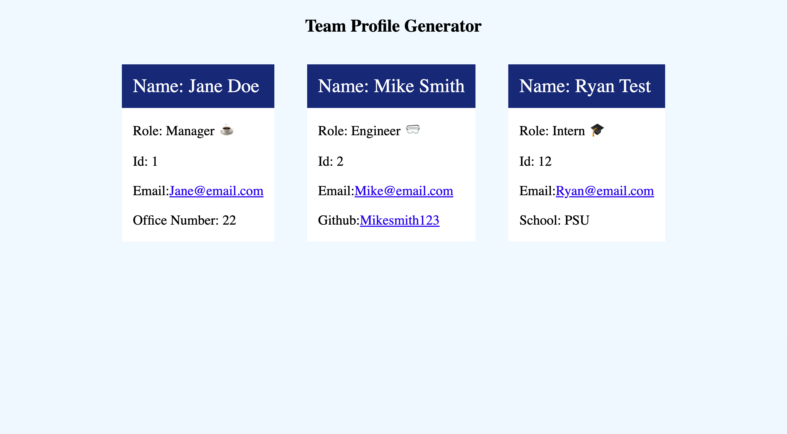

# Team Profile Generator 

  ## **Table of Contents**
  1. [license](#license)
  2. [Description](#description)
  3. [Installation Instructions](#installation-instructions)
  4. [Usage information](#usage-information)
  5. [Contribution Guidelines](#contribution-guidelines)
  6. [Test Instructions](#test-instructions)
  7. [Questions?](#questions)

  ## **License:** 
 

  This application is covered under license type: MIT

  ## **Description:** 
 A command line app that allows the user to input new employees, and renders a HTML page. 

  ## **Installation Instructions:**
 N/A 

  ## **Usage Information:** 
Open the terminal and run node index. 

  ## **Contribution Guidelines:**
 N/A 

  ## **Test Instructions:** 
N/A

  ## **Questions:**

  Github Profile: [Rjpotere](https://github.com/Rjpotere).

  Contact me by email with additional questions: [Ryan.potere@gmail.com](mailto:Ryan.potere@gmail.com)

